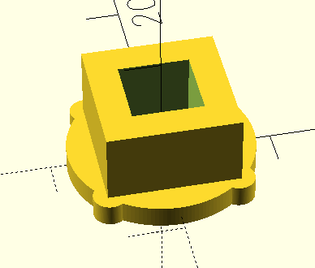
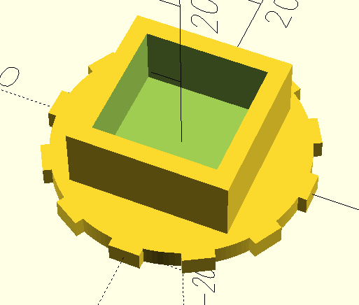
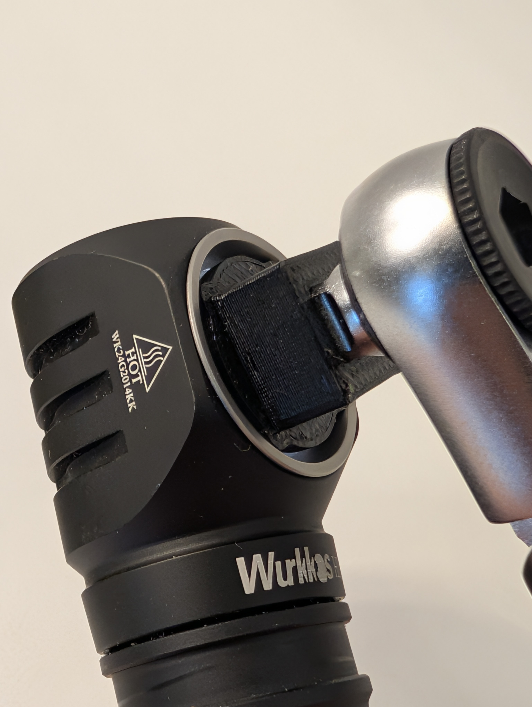

# Wurkkos HD10 Bezel Tool
This repo contains the OpenSCAD files for a tool to unscrew the bezel on the Wurkkos HD10 flashlight. The tool can be used with a 1/4" ratchet square drive or 12mm open-ended wrench (you can also change the box size to fit any wrench you'd like). Additionally, you can print a finger wrench to slip over the tool. Since they're seperate files, both can be printed without supports.

In this repo:
- `HD10-bezel-tool.scad`
  - OpenSCAD for the tool itself that inserts into the flashlight.
  - Modify the `box_outer_width` variable at the top of the file to change the size of the box for different wrench sizes.
- `12mm-finger-box-wrench.scad`
  - Printable wrench that can fit over or be glued to the tool so the tool can be used without the need for another wrench.
  - Modify the `box_inner_width` variable at the top of the file to 

## Photos
Tool rendering

Wrench rendering

Tool with HD10

